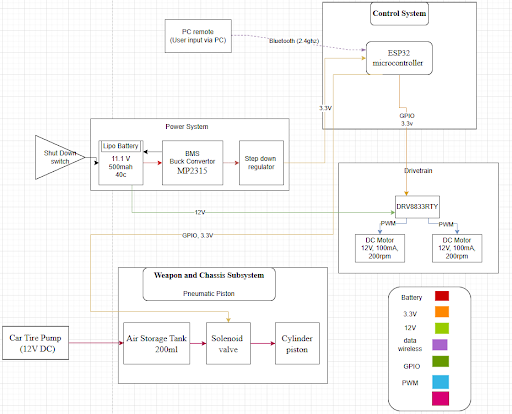
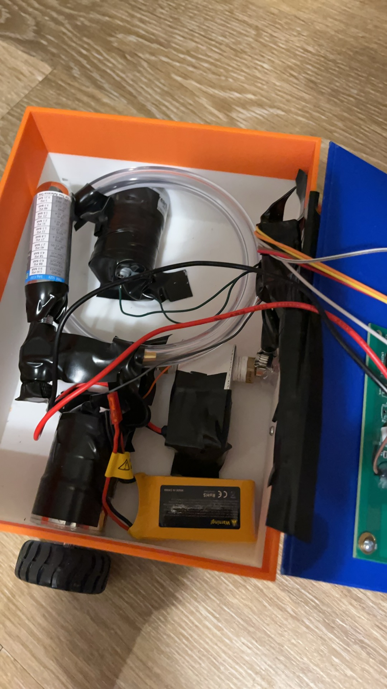

# Lab Notebook
For weekly entries of what occurred in design.

Our weekly meetings with our TA, Bill Yang, were on Mondays 6-6:30PM.

# Week of Jan 20
The beginning of the school year, formed group of: Justin, Yuxuan, and Zilong. This was the week of the Initial Web Board Post. Also when we decided on the idea of partaking in the Antweight, 3D Printed Battlebot competition hosted by Professor Gruev.

# Week of Jan 27
Our group solidifed of taking the Antweight Battlebot competition, and created our Early Project Approval to turn in 1/29. Everyone worked together to make sure to include the necessary details for the Early Project Approval ([Early RFA](Early%20RFA.md)). Also the week of the CAD assignment.

# Week of Feb 3
After third class meeting, we confirmed together that we were working on the Antweight Battlebot. Also were confirmed to be the first group to be approved - hence became Group 1. We began working together on the Project Proposal.

# Week of Feb 10
This week contained our first meeting with our TA (Bill). Beforehand, we as a team had prepared and worked on a first draft of our Block Diagram, three High-Level Requirements, and one Subsystem Requirement from our worked on Project Proposal. We had seeked feedback from Bill upon our project and got some guidance in the right direction on how to develop a Pneumatic system. We also sought advice on if we were in the right direction for our Project Proposal. This was also the week we turned in our [Project Proposal](Project%20Proposal.pdf) as well as our [Team Contract](Team%20Contract.pdf). Finally, we made sure that our Project Proposal was ready for the Proposal Review.

### Images

    

# Week of Feb 17
No weekly meeting with Bill this week. There would be a Design Review of our Project Proposal. Design Review would take place on 2/19 11AM. I believe there was an update to our high level block diagram a day before the review due to some missing parts.

### Tasks
- Everyone focuses on making sure [Project Proposal](Project%20Proposal.pdf) was ready for the Project Proposal / Design Review.
- Begin on working on PCB schematics.

# Week of Feb 24
Our weekly meeting with our TA is now Mondays 6-6:30pm. Feedback from Bill for this week was primarily about looking at our PCB schematics but this was when we had the STM32. We also did ask about changing from STM32 to ESP32 but this would later be done after the PCB Review. After the PCB Review, we were told that we were allowed to change from STM32 to ESP32. The STM32 we had originally picked did not support Bluetooth or WiFi communications, additionally, we found the ESP32-WROOM-32E to be easier to work with and supported all of our needs. We would also try to finish the PCB files before the first round PCBway orders. We also began working on the Design Document. Towards the end of the week after deciding to swap to the ESP32, we also began figuring out how to code for the ESP32 using WiFi signals as originally (Justin) thought that WiFi would be more instant than Bluetooth. However, later on we learned the actual difference between Bluetooth and WiFi is quite minimal for these kinds of projects in comparison to things that require 2.4Ghz connections (i.e. Gaming/Reaction based projects).

### Tasks
- Everyone begins working on PCB schematic and layout
- Everyone Research parts (datasheets) required for system to better understand PCB
- Everyone also work on the Design Document
- Zilong will be focusing on researching Pneumatics and schematics
- Justin and Yuxuan will be focusing on the software/programming of the ESP32, test on dev kit

# Week of Mar 3
Unfortunately, we did not finish all of the PCB schematics before the first round PCBway orders which was due during our TA meeting. This was primarily due to having to rewire components and read the datasheet of the ESP32 we picked. However, we did ask Bill more in depth questions about if what we were doing for our schematics and PCB design were good or not. We got feedback of how we could utilize the datasheets of components to easily wire everything. In terms of coding a frontend, we also asked Bill on some advice with coding our controller on PC using things like the Python library Tkinter and other frontends. During this week, we all also had to work on and turn in the [Design Document](Design%20Document.pdf). For the Design Document, also decided that we wouldn't use a step down regulator as the Buck Converter was able to change the 12V to 3.3V voltage on its own safely. Finally, Justin and Yuxuan would get ready for the Breadboard Demo by programming the ESP32 and connecting to our PC (as controller) over WiFi (hotspot) and getting some signals to work.

### Tasks
- Everyone prepare for Breadboard demo
- Everyone will work together on PCB design, primarily Zilong 
- Everyone finish the [Design Document](Design%20Document.pdf)
- Everyone get ready to order parts (pick and choosing), Yuxuan will handle most of the ordering
- Justin and Yuxuan focus on getting the ESP32 programmed (using WiFi) with a frontend controller on PC

# Week of Mar 10
No weekly TA meeting this week. For the Breadboard Demo, we were able to get a version running where we could send either 1 or 5 signals to our ESP32 and get outputs (LEDs) on the breadboard to work. However, the 5 signal version didn't work very well. From the Breadboard demo with Professor Gruev and TA Bill, we were told that we were a bit behind schedule (compared to other teams). Additionally, this was when Professor Gruev helped us make the decision of switching back from WiFi to Bluetooth because there were still secure connections over Bluetooth and reduces points of failures. 

We also finished our first revision of our PCB for the second round PCBway orders. We made sure to design our PCB utilizing the datasheets of components. Important components like the LM2596S-3.3 buck converter, power switch, ESP32-WROOM-32E microcontroller, DRV8833RTY H-Bridge module. Converted to [Gerber V1](../PCB/Gerber%20V1/) files. We also started purchasing some components.

For the coding portion: Essentially, we used a hotspot (WiFi) as our method of wireless communication for this week as it seemed more instant. Additionally, we chose hotspot due to some restrictions from the school's internet. Furthermore, we were able to get our Devkit to connect to our hotspot and computer, thus allowing for signals to be sent back and forth. We designed an interface with 5 on-screen buttons (on/off) that were mapped to specific GPIO pins (programmed) through Arduino IDE. To make sure we were sending signals properly, we connected LEDs to each of the GPIO pins programmed to see whether they could be turned on/off. The 1 version button was fine, but when changing to 5 buttons, there were some weird issues with it that we attempted to debug.

### Tasks
- Justin and Yuxuan primarily focus on getting programming done for the Breadboard Demo
- Everyone focus on getting in our PCB Design in for PCBway orders, everyone helps with schematic
- Zilong will get the PCB layout designed with assistance from Yuxuan

### Notes
- Code that we utilized for this Breadboard demo can be found in [Old Code, connected utilizing WiFi/HotSpot](../Code/Original%20Code%20(Not%20Working)/)
- The portions of our original PCB design that we used can be found in [Design Document](Design%20Document.pdf). The actual Gerber files (that we still have) can be found in [PCB Gerber Rev 1 Files](../PCB/Gerber%20V1/)

# Week of Mar 17
The week of spring break. Attempt to get back on schedule if time. Ordered some components. Found Dabble library to utilize for controller (on Phone) and connect to the ESP32.

### Tasks
- Everyone if time, do what we can to get back on schedule
- Justin and Yuxuan find software changes if time

# Week of Mar 24
During our weekly TA meeting, we got some advice on 3D printing (i.e. what software to use). Additionally we got some advice on our PCB on components, programming the chip, etc. We also got more advice on Pneumatic system. In this week, we began playing around with 3D prints to see what our Battlebot would need in size, etc. More importantly, Second Round PCBs arrived. However, after attempting to test, we figured out that the board wouldn't have worked properly. This was because in the original schematic wiring, (Justin) didn't realize that labeling a wire "12v_out" and KiCad's "12V" label are different, which thus made virtually anything connected to the 12V wire not powered. As such, we had to fix this for third round orders. We also sized down our board to make it more compact. Made many more adjustments to the PCB in general - including programming pins, Pneumatic placeholder, rewiring certain pins - this version can be found in [PCB V2](../PCB/group1_battlebot/). Also, Justin and Yuxuan made lots of progress for the software portion, only needs minor changes (if any). Finally, Zilong made a first version of his Pneumatic system with some testing.

### Tasks
- Zilong will focus on 3D prints, Yuxuan will also help work on this
- Zilong work on Pneumatic system with help from Yuxuan
- Justin and Zilong fix PCB
- Justin and Yuxuan work with Dabble library coding

### Notes
- Code created can be found in [Final Code](../Code/Working%20Code/). How it's used can be found in [Code Information](../Code/Important_Code_Info.md)

# Week of Mar 31
During our weekly TA meeting, we mostly demoed the Pneumatic system working utilizing the power supplies (I believe at this time it was running using NMOS transistors for the demo with Bill). Also during this meeting, we ordered the 3rd round PCBs. The advice we got mostly related to the Pneumatic system in this week on how to keep it together and related information that we kept in mind. This week was mostly testing some components that we could on the 2nd round board. Zilong also was trying to find the correct NMOS for the Pneumatic system.

### Tasks
- Everyone prepare for 3rd round PCBs (components)
- Justin and Yuxuan any last minute software changes
- Zilong changes with 3D prints
- Everyone some testing with components we had

# Week of Apr 7
The weekly TA meeting, we ordered more components. We also demoed the Pneumatic system working a bit more consistently as well with the piston with more "firepower". Ultimately, the Pneumatic system was a bit more air tight than the previous week and was more consistent in firing/attacking. This may also have been the week Zilong transitioned from the NMOS to BJT such that it was activated based on current rather than voltage. In this week, the third round PCBs arrived - our revision two. For the most part, we were soldering on components and unit testing the different subsystems to verify they worked. We did struggle with the hot air gun and hot plate at first, sometimes applying too much heat and burning some chips. We were also informed of the reflow oven for using solder paste instead which would make our lives easy later on.

### Tasks
- Everyone work on soldering and Unit testing components
- Zilong continue to work on 3D prints
- Zilong modify the Pneumatic system as required
- Justin and Yuxuan be ready for changes to software

# Week of Apr 14
During this weeks weekly TA meeting, we demoed the Pneumatic System working more reliably. Addiitonally, we finally triggered it using the ESP32 dev kit control signal. By this point, Zilong had changed the Pneumatic system to use a BJT instead of NMOS. Zilong also needed a slightly altered circuit to reliably trigger the Pneumatic system. He utilized the TIP120 BJT chip, added in things like a flyback diode, and have a 10k-ohm resistor between the microcontroller and the base of the TIP120 to limit current draw. This made the Pneumatic system a lot more reliable in triggering. Besides this, everyone continued to work on soldering, unit testing, and debugging our circuit. Test the parts according to the design/verification as found in [Design Document](Design%20Document.pdf).

### Tasks
- Everyone continue to solder, unit test, and debug circuit
- Zilong continue working on Pneumatic
- Zilong continue to work on 3D prints

# Week of Apr 21
In the weekly TA meeting with Bill, we were to perform our Mock Demo. We were able to demonstrate full functionality of the individual subsystems. The control and weapon subsystems (power subsystem was a bit harder to show) we were able to demonstrate easily. The drivetrain subsystem was a little bit more difficult as we had to figure out why the chip itself wasn't working properly; we were able to show that the actual code was correct for directional inputs and activating Pneumatic weapon. Finally, we realized that the H-Bridge (DRV8833RTY) was wired (somewhat) incorrectly. The DRV8833RTY VM's pin only supports a max of 10.8V but we were giving it 12V (11.1V+) from the battery/power supply. We diagnosed this by checking the nFault pin which would read logic level low when there is a faulty condition. As such, the only possible reasons were because we had fried the chip or burnt it (from the reflow oven). It was most likely due to giving a higher voltage than it could handle. 

We had to make the difficult decision of utilizing a separate PCB H-Bridge module because it was too hard to rewire values for another H-Bridge and it was also too late to order a new PCB. The H-Bridge we went with was the L9110s driver. It essentially functions the same as the DRV8833RTY but it can support the 12V that we needed.

We also began 3D printing the final versions of our chassis and weapon (scooper). We also got the final revisions of our circuit soldered together and assembled everything together into the Battlebot. Mount things like the Pneumatic System, drivetrain, weapon, PCB to the lid for space management. This is probably the time (Justin) charged the battery using power supply (felt really sketchy/wrong just connecting wires into the battery, but still worked). We also performed testing/verification on the different components. All testing results can be found in [Final Presentation](Ant-weight%203D%20Printed%20Battlebot%20slides.pdf) or [Final Report](ECE%20445%20Final%20Report.pdf).

### Tasks
- Everyone prepare for Final Demos, make sure circuit works as intended
- Everyone get final 3D prints ready - [3D Print Materials](../3D_Print/)

### Notes
- I think this was the week we extended the tube length of Pneumatic system for more power.

# Week of Apr 28
No weekly TA meeting (I think?). This was the week of Final Demos and Mock Presentations. We had a fully working Battlebot with all our specifications ready on Monday. Minutes before the actual Final Demo on 4/28, we somehow managed to fry the Buck Converter, which then fried our ESP32 (tested using voltmeter/multimeter). Luckily, Professor Gruev was kind enough to allow us to Demo on Wednesday. We overnight shipped a new buck converter (LM2596S-3.3) from Digikey and resoldered everything onto a new board (with a new ESP32) and reprogram it. We then electrical taped the inside of our Battlebot for any components we suspected could somehow accidentally cause short circuits or touch other components. We successfully made the Final Demo, Battlebot pictures and more in depth can be found in [Final Presentation](Ant-weight%203D%20Printed%20Battlebot%20slides.pdf). Also had mock presentations this week which we used to then enhance our Final Presentation to what it is now.

### Tasks
- Everyone get ready for Final Demos, make sure board is working
- Everyone prepare/finish [Final Presentation](Ant-weight%203D%20Printed%20Battlebot%20slides.pdf) (for both Mock and Final Presentation)
- Everyone get ready to present the Final Presentation
- Also performed Extra Credit Video Assignment [Extra Credit Video](https://youtu.be/LQH7uXVlK6E)

### Images

    

### Notes
- All 3D prints can be found in [3D Print Materials](../3D_Print/)

# Week of May 5
No weekly TA meeting. We all worked on the [Final Paper](ECE%20445%20Final%20Report.pdf) after the Final presentation. Also worked on the Lab Notebook together and getting everything pushed to our GitHub repo.

### Tasks
- Everyone perform [Final Presentation](Ant-weight%203D%20Printed%20Battlebot%20slides.pdf)
- Everyone finish Final Paper
- Everyone finish Lab Notebook
